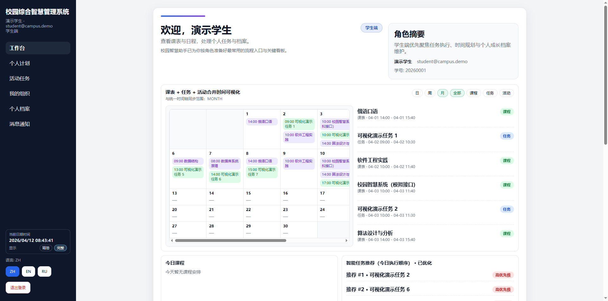
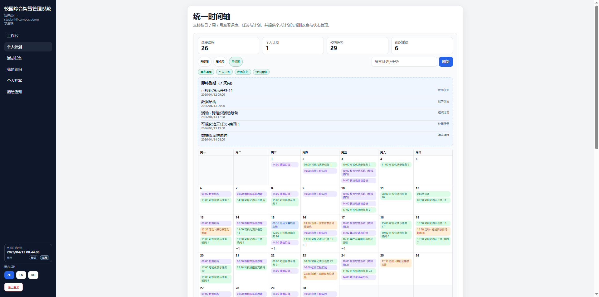
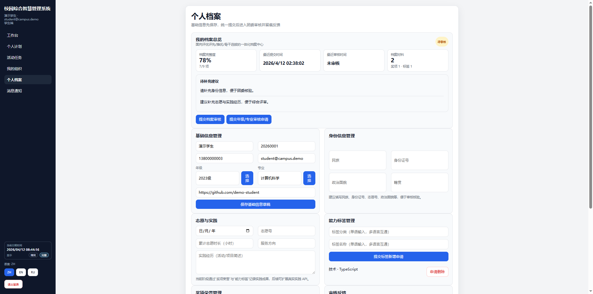
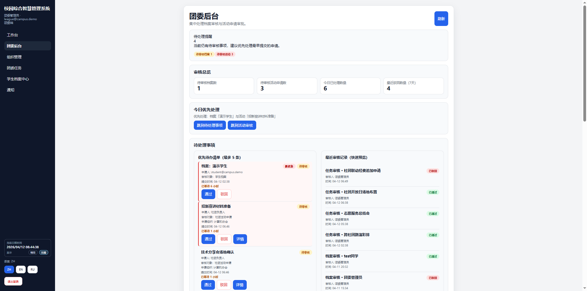

# 🎓 校园综合智慧管理系统（Campus Smart System）

面向高校学生与团委管理场景，构建集 **时间管理、任务协同、学生档案中心** 于一体的综合平台，支持三端协同与三语言切换。

---

## 📌 项目简介

本系统围绕高校真实业务需求，重点解决：

- 学生课表、任务、计划信息分散问题  
- 校园任务、组织任务与个人安排缺乏统一视图的问题  
- 学生档案信息不规范、难以用于评优评先的问题  

通过构建：

- ✅ **时间与任务中心（统一时间轴）**
- ✅ **组织 OA 与任务流转系统**
- ✅ **学生个人档案中心（审核备案）**

实现学生个人时间与校园事务的一体化管理。

---

## 🏆 赛事要求对应关系

### （一）学生时间与任务管理模块
- 统一时间轴视图（课程 / 任务 / 计划 / 校园事项）
- 多维度时间信息整合展示
- 个人计划与任务自主管理
- 校园统筹事项与组织任务同步
- 即将到期事项提醒
- 模拟课表 API 接入

---

### （二）组织 OA 与任务流转系统
- 组织任务创建、分配与流转
- 团委全局任务看板
- 多组织协同管理
- 任务状态统一（待处理 / 进行中 / 已完成）

---

### （三）学生个人档案中心
- 基础信息与身份信息管理
- 能力标签与奖项荣誉管理
- 档案审核、驳回与备案机制
- 支撑评优评先与学生骨干选拔

---

## 📸 页面预览

> 请将截图放入：`docs/screenshots/`

### 🏠 学生端：首页（Dashboard）


---

### 🕒 时间与任务中心（核心亮点🔥）


👉 统一整合：
- 课表
- 任务
- 计划
- 校园事项

---

### 📁 学生档案中心


👉 展示：
- 档案完整度
- 审核状态
- 标签 / 奖项

---

### 🏛 团委端：档案审核中心


👉 展示：
- 审核流程
- 驳回机制
- 审核记录

---

## 🎬 系统演示流程（答辩用）

### Step 1：学生登录
账号：`student@campus.demo`

展示：
- 首页 Dashboard
- 今日任务 / 今日课程

---

### Step 2：时间与任务中心（核心）
展示：

> 课表 + 任务 + 计划统一在时间轴

强调：

> 实现多源数据统一视图

---

### Step 3：创建任务
- 新建任务
- 标记完成

👉 自动同步时间轴

---

### Step 4：学生档案中心
展示：
- 审核状态
- 标签 / 奖项

说明：

> 支撑评优评先的数据沉淀

---

### Step 5：切换团委账号
账号：`league@campus.demo`

进入审核中心

---

### Step 6：执行审核
- 通过 / 驳回
- 填写原因

---

### Step 7：返回学生端
展示：
- 审核结果变化
- 驳回原因反馈

---

### Step 8（加分）
三语言切换：
- 中文 / English / Русский

---

## 🌐 三语言支持

系统支持：

- 中文（zh）
- English（en）
- Русский（ru）

覆盖：
- 页面内容
- 按钮
- 状态标签
- 提示信息

---

## 🧠 模拟 API 与样本数据说明

由于学校暂未提供：

- 课表 API
- 志愿服务 API
- 综合实践 API

本项目采用：

> ✅ 模拟 API + 样本数据

包括：

- 课表数据
- 时间轴数据
- 任务数据
- 档案数据

目标：

- 实现模块数据互通
- 可扩展真实 API
- 避免数据孤岛

---

## ⚙️ 技术栈

### 前端
- Next.js 14
- TypeScript
- next-intl

### 后端
- NestJS
- Prisma ORM
- PostgreSQL

### 部署
- Docker Compose

---

## 📦 部署说明（赛事要求）

### 1️⃣ 前置条件

- Docker Desktop（或 Docker Engine）可用
- Docker Compose v2 可用（支持 `docker compose`）
- 网络正常（首次构建镜像需要下载依赖）

---

### 2️⃣ 一键部署脚本（推荐）

#### Windows（PowerShell）

```powershell
./start.ps1
```

#### Linux / macOS（Bash）

```bash
chmod +x ./start.sh
./start.sh
```

脚本将自动执行：

- 检查 Docker / Docker Compose
- 启动并构建容器：`docker compose up -d --build`
- 等待 `backend` 与 `frontend` 健康检查通过

---

### 3️⃣ 手动启动（备用）

```bash
docker compose up -d --build
```

---

### 4️⃣ 访问地址

- 前端：<http://localhost:3000>
- 后端健康检查：<http://localhost:3001/api/health>

---

### 5️⃣ 默认测试账号

| 角色 | 邮箱 | 功能说明 |
|---|---|---|
| 学生 | `student@campus.demo` | 时间轴 / 档案 |
| 社团负责人 | `org@campus.demo` | 组织任务 |
| 团委管理员 | `league@campus.demo` | 审核后台 |

统一密码：`demo123456`

---

### 6️⃣ 常见问题

- Docker 无法启动：请先确认 Docker Desktop 正常运行
- 页面无法访问：执行 `docker compose ps` 查看容器状态
- 数据为空：执行 `docker compose exec backend npm run db:init`

---

### 7️⃣ 其他说明

- 前端统一通过 `/api` 访问后端
- 当前数据为模拟数据（符合赛事要求）
- 支持后续接入真实校园 API

---

## 🧠 项目亮点

- 🔥 统一时间轴整合多源数据
- 🔥 学生档案中心 + 审核闭环
- 🔥 三端协同（学生 / 社团 / 团委）
- 🔥 三语言国际化
- 🔥 Docker 一键部署